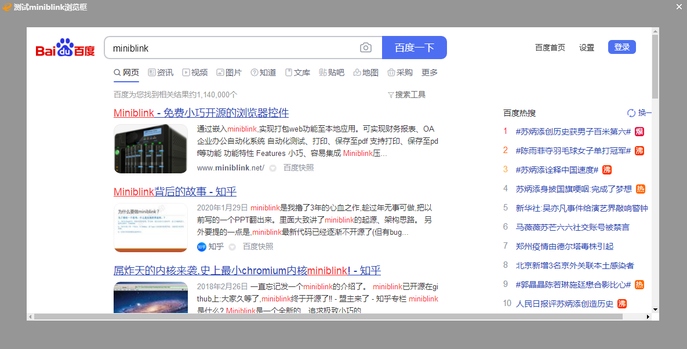

ExDUIR
=======

## 简介

Windows平台轻量DirectUI框架。

本项目基于ExDirectUI 4.1.18开源版重写。

## 相对于原版的改进

请查阅[更新日志](CHANGELOG.txt)

## 问题反馈&帮助
* 交流QQ群: 214406227
* 提交反馈：[Gitee issues](https://gitee.com/william_lzw/ExduiR/issues) 或者 [GitHub issues](https://github.com/laizewei/ExduiR/issues)

## 编译
目前支持以下两种方式编译：
* Visual Studio 2019或2022。
  工程文件ExDUIR.sln。包含以下项目：
  * dll: 可编译兼容原版ExDirectUI的动态库。 -> libexdui.dll
  * libexdui: 编译为静态库。 -> libexdui.lib
  * test: 测试工程。
* CMake。只支持MSVC编译器。

## 特点
* 绘制函数是DirectX11、Direct2D，效率比GDI高上百倍。
* Unicode编码，支持多国语言。
* 仿Windows消息机制，通过发送消息，分发通知给组件，兼容原生Windows消息和常量。win32 api写法，比类写法扩展性更灵活。
* 调用方式采用Win32风格API方式，支持生成lib静态库和dll动态库。生成的动态链接库支持被其它语言如python、java、go、dephi、C#、VB、易语言等调用。
* 扩展组件自由灵活，引擎处理底层逻辑。用户只需编写绘制代码，不需要考虑复杂的消息处理。
* 目前支持组件有按钮、开关、单选框、选择框、编辑框、富文本编辑框、列表框、报表列表、分组框、组合框、菜单、树形框、滑块、单选框、选择框、选项卡、加载动画框、旋转图片框、页面、图片框、消息框、图标列表、列表按钮、miniblink浏览框、工具条、状态条、日期框、调色板、标题框、月历框，可以在这些组件基础上超类化扩展组件。
* 支持布局，布局可以在窗口尺寸改变情况下自动更新组件位置。目前支持的布局有绝对布局，相对布局、线性布局、流式布局、表格布局。用户可以扩展布局。
* 支持APNG、GIF格式图片自动播放动画，支持图片格式PNG、APNG、JPEG、BMP、GIF、WEBP。窗口或组件都可以用以上格式图片做背景图。
* 支持34种缓动特效，用户可以自由编写窗口缓动或组件缓动特效。用户可以扩展缓动算法。
* 窗口支持异型窗口，图片形状窗口。窗口和组件支持0到255透明度。支持高斯模糊。
* 编辑框支持富文本，支持加载RTF格式文档。
* 窗口或组件支持接收拖曳文件或文本。
* 支持模态窗口。
* 支持限制区域消息通知。

## 扩展组件说明
Ex_ObjRegister注册组件类,在回调callback的WM_PAINT消息里绘制组件,其它消息控制组件状态。使用时创建类名为该类的组件即可。组件需要的属性个数在Ex_ObjRegister的cbObjextra设置,默认每个大小都是8字节。使用索引从0开始(负数为基础组件内置索引,勿用)。用Ex_ObjSetLong设置属性,用Ex_ObjGetLong取属性。

* 可以在基础组件回调基础上超类化扩展组件参照Class_RotateImageBox_ex.cpp,回调默认返回Ex_ObjCallProc
* 可以重新自定义组件回调扩展组件参照Class_TitleBar_ex.cpp,回调默认返回Ex_ObjDefProc

绘制组件开始调用Ex_ObjBeginPaint函数，传入绘制结构体，结束绘制记得调用Ex_ObjEndPaint。

## 感谢名单(排名不分先后)
壹丁、Sunshine、SupMe、何永

## Demo
### demo_all:  
    
### demo button and switch:  
    
### demo buttonex:  
    
### demo combobox:  
       
### demo custom menu:  
    
### demo custom background:  
    
### demo drag obj:  
    
### demo drop and drag:  
    
### demo easing: 
    
### demo edit and richedit:  
   
### demo editex:  
    
### demo groupbox:  
    
### demo iconlistview:  
      
### demo irregular shape window:  
    
### demo label and background:  
   
### demo layout-absolute:  
    
### demo layout-flow:  
    
### demo layout-linear:  
    
### demo layout-relative:  
    
### demo layout-table:  

### demo listview:  

### demo loading:  

### demo matrix:  

### demo menubutton:  

### demo messagebox:  

### demo navbutton:  

### demo nchitest:  

### demo progressbar:  

### demo radio and checkbox:  

### demo reportlistview:  

### demo rotatebox:  

### demo sliderbar:  

### demo treeview:  

### demo modal:  

### demo miniblink:

### demo titlebar:

### demo datebox:

### demo palette:

### demo calendar:
